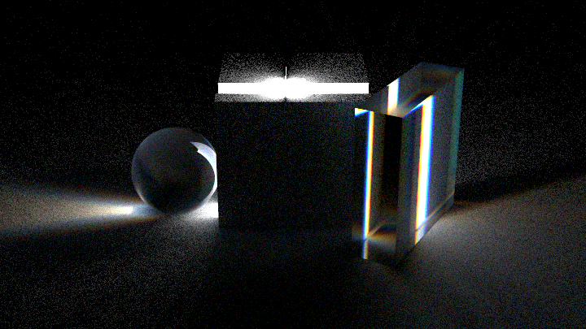
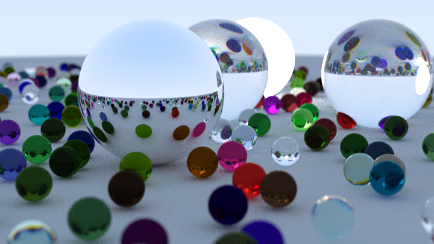
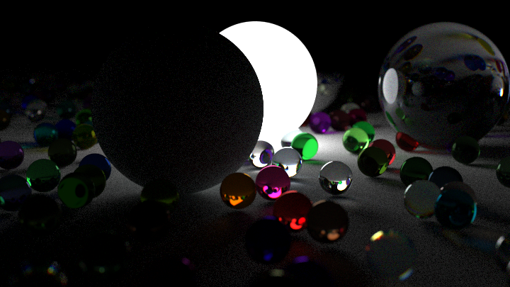

# RaytracingWeekend

Implemented a basic raytracer by following the [_Ray Tracing in One Weekend_](https://raytracing.github.io/books/RayTracingInOneWeekend.html) books by Peter Shirley. 

## Improvements
My version extends the basic tracer described in Book 1 by adding:
1. Simple dispersion model (rays split into 3 discrete colors)
2. GUI
3. More primitives (mostly from book 2 and triangle intersections using the Möller Trumbore algorithm)
4. Sampling and filtering as described in the book [Physically based rendering](https://pbr-book.org/3ed-2018/contents)
5. Obj loading based on [this OpenGL tutorial](http://www.opengl-tutorial.org/beginners-tutorials/tutorial-7-model-loading/), slightly improved to utilize newer C++ features
6. Directional lights (only emmit light when hit within the determined angle, e.g. to simulate lasers)
7. 16bit floating point EXR support (for HDR and better color depth) using an adapted version of [mini exr](https://github.com/aras-p/miniexr)

### Performance
1. Multithreading support
2. Pseudo random generation. By calculating a large set of random numbers in advance improved performance by more than 2x (without any visual difference)
3. Replacing shared_ptr with raw pointers for the hit_records. As these are being created at every ray bounce, the overhead of incrementing and decrementing the internal reference counter became quite significant. 10% speedup.
4. Minor restructuring to take advantage of compiler optimization and reduced branching 
5. Faster cube intersection method adapted from the [PSRaytracing repository](https://github.com/define-private-public/PSRayTracing)
6. Better BVH, that doesn't create a copy of the scene array for each node.

## Impressions

## TODO:
- Better BVH splitting using surface area heuristics
- Shadow rays/bidirectional raytracing
- Sobol sampling everything for faster convergence
- RNG object per thread for better performance
