# RaytracingWeekend

Implemented a raytracer by following the [_Ray Tracing in One Weekend_](https://raytracing.github.io/books/RayTracingInOneWeekend.html) books by Peter Shirley. 

## Improvements
My version extends the basic tracer described in Book 1 by adding:
1. Two dispersion models (1: rays split into 3 discrete colors, 2: continuous blackbody spectrum is dispersed, conversion of wavelength to color at the end)
2. GUI
3. More primitives (mostly from book 2 and triangle intersections using the Möller Trumbore algorithm)
4. Sampling and filtering improvements as described in the book [Physically based rendering](https://pbr-book.org/3ed-2018/contents)
5. Obj loading based on [this OpenGL tutorial](http://www.opengl-tutorial.org/beginners-tutorials/tutorial-7-model-loading/), slightly improved to utilize newer C++ features
6. Directional lights (only emmit light when hit within the determined angle, e.g. to simulate lasers)
7. 16bit floating point EXR support (for HDR and better color depth) using an adapted version of [mini exr](https://github.com/aras-p/miniexr)

## Gallery

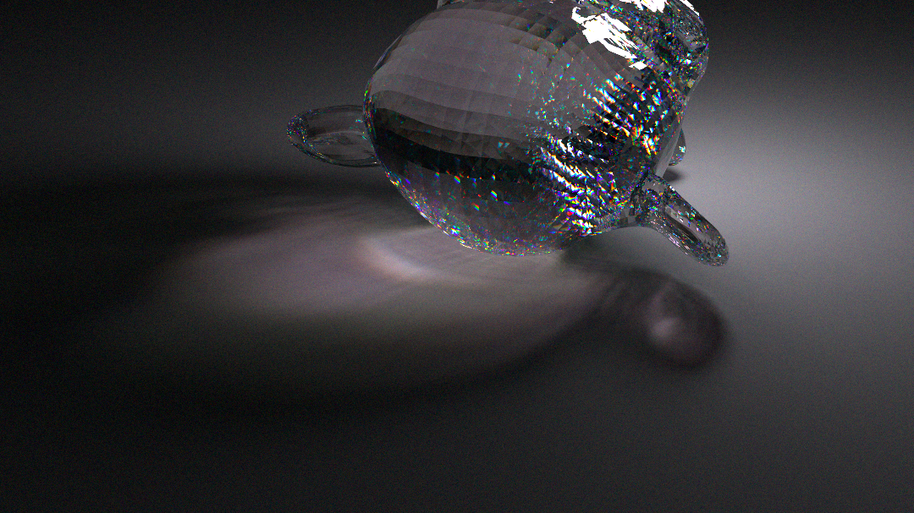
Caustics and dispersion from a sphere light through a triangle mesh.  

Dispersion is visible at the edges of the glass spheres (rainbow colored edges)

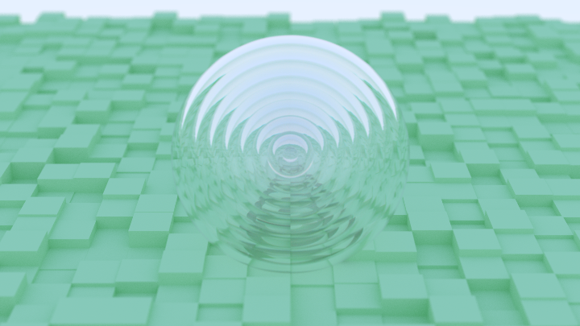

Programatically generated scene with concentric glass spheres

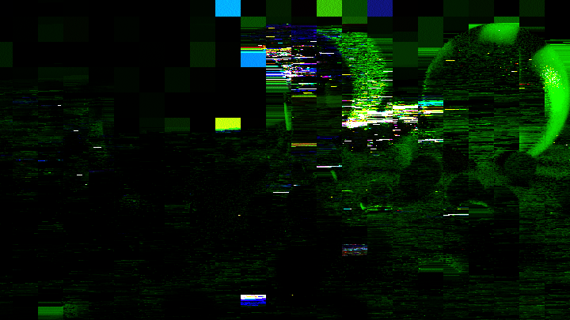

Artifacts caused by race conditions between multiple threads which try to write into the image array.

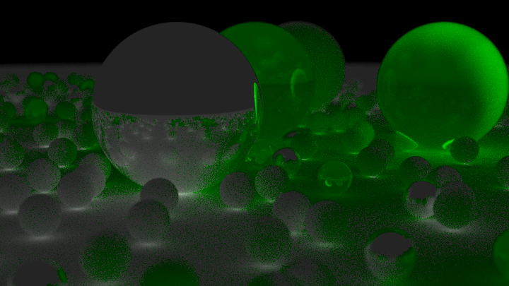

All light rays that travelled through glass are colored in green for debugging purposes.

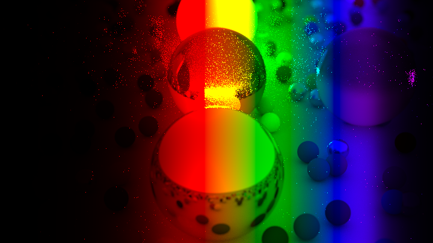

Rainbow produces by interpolating RGB looks unnatural and would not produce realistic dispersion.

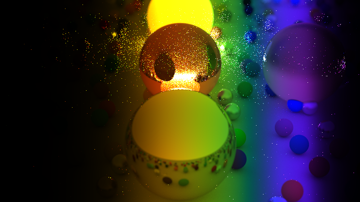 

Rainbow produced by simulating the intensity of different wavelengths using the planck spectrum. The wavelengths are convoluted by the sensitivity spectrum of our eyes receptors to get the color we would see. This produces a realistic spectrum image and much better dispersion. 

Another advantage of this approach is that we can realistically simulate the color of blackbody radiation by setting the temperature of the object to the desired value.

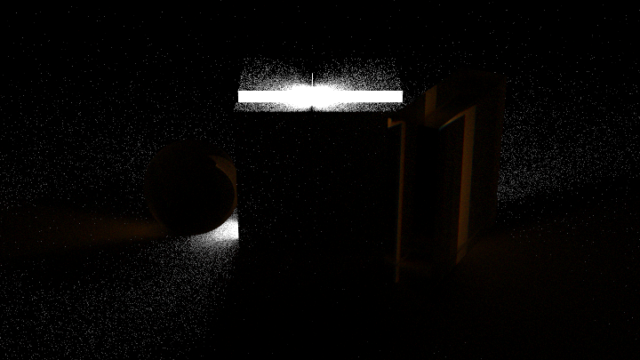

2000K blackbody radiation

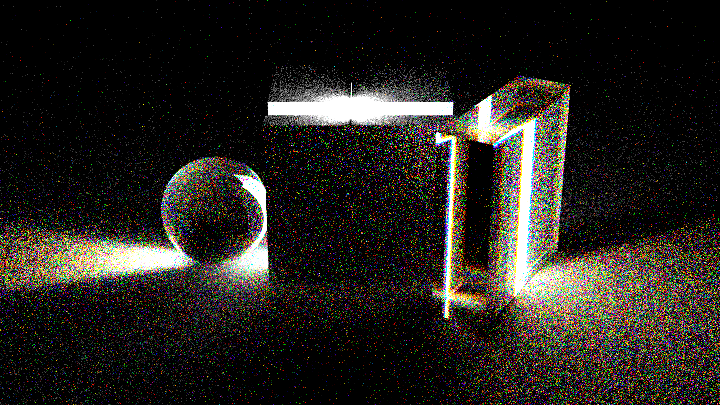

4500K blackbody radiation

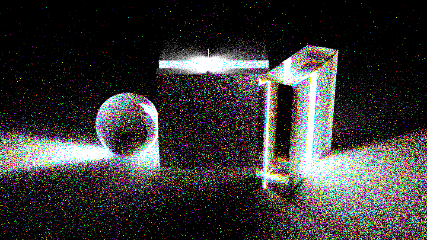

8000K blackbody radiation

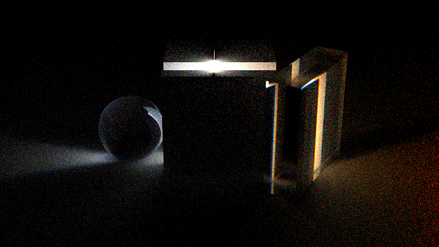

Image produced by changing the temperature of the lightsource during the render

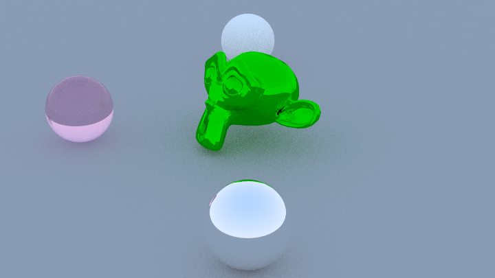

Testing OBJ file loading 

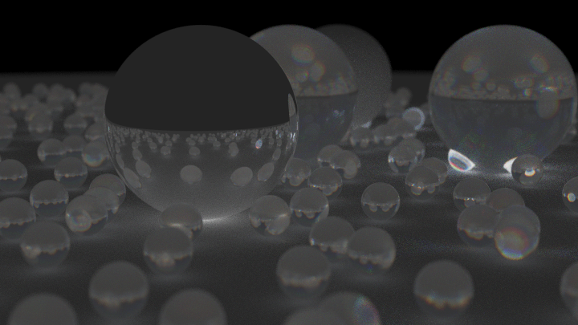

Simplified RGB dispersion model, debug image

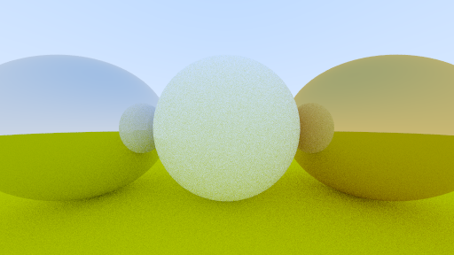

Reference image of 3 spheres made from different materials

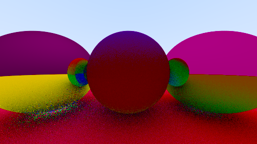

What happens if we apply a cross product instead of a dot product to the normals?

### Performance
1. Multithreading support
2. Different sampling strategies
3. Replacing shared_ptr with raw pointers for the hit_records. As these are being created at every ray bounce, the overhead of incrementing and decrementing the internal reference counter became quite significant. 10% speedup.
4. Minor restructuring to take advantage of compiler optimization and reduced branching 
5. Faster cube intersection method adapted from the [PSRaytracing repository](https://github.com/define-private-public/PSRayTracing)
6. Better BVH, that doesn't create a copy of the scene array for each node.
7. thread_local RNG objects, to make it fully parallelizable (before, a single RNG object was being accessed from all threads and became the bottleneck, as it was the only single threaded operation.)

## TODO:
- Better BVH splitting using surface area heuristics
- Sobol sampling everything for faster convergence
